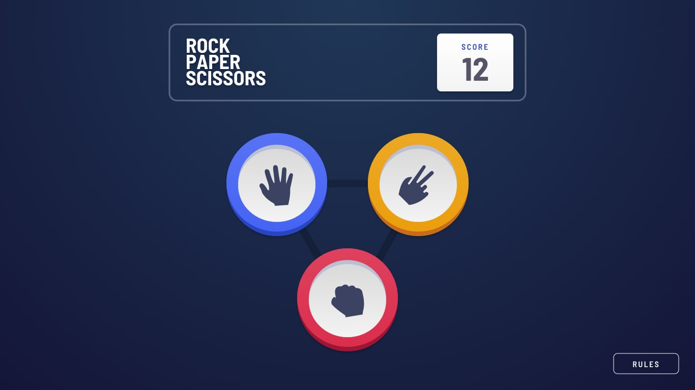

# Frontend Mentor - Rock, Paper, Scissors solution

This project is a polished implementation of the Rock, Paper, Scissors challenge with a bonus mode that includes Lizard and Spock. The experience was built to feel visually close to the original design while keeping the code organized, responsive, and easy to extend.

## Overview

### Challenge

The project focuses on delivering a complete game experience with:

- responsive layout for mobile and desktop
- classic and bonus gameplay modes
- score tracking across rounds
- state transitions for round flow
- rules modal for the active mode
- polished interaction feedback and result display

### Screenshot

## My process

### Built with

- React 19
- Vite
- JavaScript
- Tailwind CSS
- Barlow Semi Condensed font
- localStorage for persistence

### Architecture

The app was structured to keep the logic and UI clearly separated:

- `src/App.jsx` manages the main state and game flow
- `src/components/game` handles board interaction and result rendering
- `src/components/layout` contains the header and score panel
- `src/components/rules` renders the rules modal
- `src/constants` stores the rules for each playable option
- `src/utils` contains the logic for random selection and winner validation

This separation made the implementation easier to maintain and scaled well for the bonus mode without duplicating logic.

### What I learned

This project strengthened several core frontend skills:

- state management in React for multi-step user flows
- component-based architecture for interactive interfaces
- modularization of game logic and business rules
- responsive UI design with a mobile-first mindset
- browser persistence with localStorage
- UX considerations for transitions, feedback, and game clarity

It was also a valuable exercise in balancing visual fidelity with maintainable code structure, which is a common challenge in real product work.

### Continued development

Potential improvements for future iterations include:

- richer animations for reveal and result transitions
- sound effects and more dynamic feedback
- unit tests for winner logic
- saved match history or advanced score tracking
- accessibility refinements for keyboard navigation and screen readers

### Useful resources

- [Frontend Mentor challenge](https://www.frontendmentor.io/challenges/rock-paper-scissors-game-pTgwgvgH)
- [React documentation](https://react.dev/)
- [Tailwind CSS docs](https://tailwindcss.com/docs/installation)
- [Vite documentation](https://vite.dev/guide/)

## Author

- Name: Leo
- GitHub: [your-profile](https://github.com/your-profile)
- Frontend Mentor: [@yourusername](https://www.frontendmentor.io/profile/yourusername)

## Acknowledgments

This project was a strong exercise in building a complete UI and interaction model from a design reference, and it helped sharpen both technical and product-thinking skills in front-end development.
